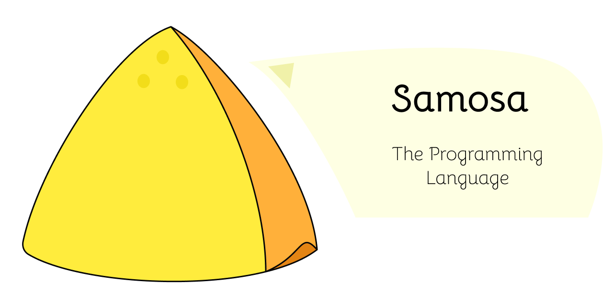

<p align="center"></p>
<p align="center"><a href="https://lgtm.com/projects/g/souris-dev/samosac-jvm/alerts/"></a>
<a href="https://lgtm.com/projects/g/souris-dev/samosac-jvm/context:java"></a></p>
<p align="center"><i>Welcome, samosa lovers!</i><br><br></p>
<b>Samosa is a statically-typed general purpose programming language that runs on the JVM.</b>
<br><br><i>Note: Samosa - the programming language, is named after an Indian snack called "samosa", and is pronounced as "some-o-saah" (the part "saah" is pronounced like the word "sour", but without the "r").</i>
<br><br>
<a href="http://playground.samosa-lang.org">Try it out</a> or <a href="https://souris-dev.github.io/samosac-jvm">read the docs.</a>

<h2 align="center">Installation</h2>
<i>This section will be updated soon with the other alternatives for installing samosa.</i>

<h3>Using a pre-built executable jar</h3>

You really don't need to install anything if you already have JRE (minimum java version 11) installed. Otherwise, you'll have to install that first.

Head over to <a href="https://github.com/souris-dev/samosac-jvm/releases">releases</a> to grab the latest version of the compiler (it is an executable JAR file, named in the format: `samosac-<version>-full.jar`)

You now have the compiler, yay!

<h3>Building from source</h3>
<b>Note: Ensure that you have the following installed (and in your PATH) before using the upcoming commands to build from source:</b>
<ul>
<li><b>git</b></li>
<li><b>&ge; JDK 11 (the project was developed on JDK 17, but the code is compatible with java version >= 11.)</b></li>
<li><b>Apache Maven 3.1 or higher version</b></li>
</ul>
<br><br>To download the source and build it using maven, run these in the terminal of your choice:

<br><pre><code>git clone https://github.com/souris-dev/samosac-jvm.git
cd samosac-jvm
mvn compile
</code></pre>

Then, to build the compiler jar, use (from within the project directory):
<br><pre><code>mvn package</code></pre>

<br>This will create a <code>samosac-&lt;version&gt;-full.jar</code> file in the <code>target</code> folder. This is the compiler jar.

<h2 align="center">Usage</h2>
<b>Note: Ensure that you have the JRE (minimum java version 11) installed before starting this section.</b><br>

<h3>Compilation</h3>
Type your samosa program in a file, and name it something (for example samosa.samo).
Then use the .jar file of the compiler to compile it <b>(ensure that you have java in you PATH)</b>:<br>
<br>
<pre><code>java -jar samosac-&lt;version&gt;-full.jar samosa.samo
</code></pre>

(Replace <code>samosac-&lt;version&gt;-full.jar</code> with the relative path to the compiler jar file, and <code>samosa.samo</code> with the relative path to the file you wrote your program in.)

<br><i>This section will be updated.</i>

<h3>Running the program</h3>

As samosa compiles to JVM bytecode, a `.class` is generated, named as per your filename.
So for the above example, a file named `SamosaSamo.class` would be created in the `./out` directory.
<br><br>To run it, do this <b>(ensure that you have java in your PATH)</b>:

```
cd out
java SamosaSamo
```

<h2 align="center">Syntax</h2>

As samosa is still in its first release, it has limited features. More features will be added soon in upcoming releases.
<br>

<h3>Starting a program</h3>
Any samosa program must start with <code>&lt;samosa&gt;</code> and end with <code>&lt;&#47;samosa&gt;</code>.
<br>Note that statements in samosa end with a period (<code>.</code>).
For example:

```
<samosa>
("Hello World!") -> putout.
</samosa>
```
(Note: in the example above, we are making a function call to <code>putout</code>, a built-in function. That line is equivalent to `System.out.println("Hello World!")` in Java.)

<h3>Comments</h3>
Comments in samosa can span multiple lines. They start with <code>&#47;&#42;</code> and end with <code>&#42;/</code>.
Example:

```
<samosa>
/* This line is a comment and will not be executed. */
("This line is executed.") -> putout.
</samosa>
```

<h3>Variables</h3>
Variables are declared with the keyword <code>bro,</code> &nbsp;(yes, the comma is necessary :-)).
Currently, variables can be only of three types: <code>int</code> (for integers), <code>string</code> (for strings), or <code>boolie</code> (for boolean values).

Some examples of declaration and initialization:

```
<samosa>
bro, i: int = 0.
bro, str: string = "hello!".
bro, aBoolVal: boolie = true.

/* Variables can also just be declared. */
bro, j: int.
bro, str2: string.
bro, boolieVal: boolie.
</samosa>
```

If a variable is only declared, the variable is assigned the default value for that type:
1. for `int`, the default value is 57005 (in hex, `0xDEAD`).
2. for `string`, the default value is `lawl`.
3. for `boolie`, the default value is `true`.

If you're initializing a variable at the same time when you are declaring it, you can skip writing its type:

```
<samosa>
/* Types will be inferred for these: */
bro, i = 0.
bro, str = "string".
bro, aBoolVal = true.
</samosa>
```

<h3>Expressions</h3>

Expressions in samosa work in pretty much the same way as in Java/C++ or many other languages.
<p>Integer literals allow digits from 0 to 9. Hex or octal number systems are not yet supported.
If your result is a floating point number, it will be converted to an int
by taking off the part after the decimal point.</p>

<p>String literals start and end with double quotes. You can use the <code>+</code> operator for string concatenation.</p>
  Some example expressions:

```
<samosa>
bro, str = "string" + "literal".

bro, anIntVal = 3 + 4 / 4.

/* Boolean expressions: */
bro, aBoolVal = true or false.
bro, anotherBoolVal = anIntVal > 10.
bro, someBoolVal = anIntVal == 10 and anotherBoolVal.
bro, boolval = anIntVal != 100.
</samosa>
```

For boolean expressions, any of `true`/`True`/`yes`/`TRUE` can be used for a truthy value.
<br>For a falsy value, any of `false`/`False`/`nope`/`FALSE` can be used. 

In boolean expressions:
<ul>
<li><code>||</code> or the keyword <code>or</code> stands for a <b>logical OR (not short-circuited)</b></li>
<li><code>&&</code> or the keyword<code>and</code> stands for a <b>logical AND (not short-circuited)</b></li>
<li><code>||!</code> or the keyword<code>strictor</code> stands for a <b>logical XOR</b></li>
<li><code>!!</code> or the keyword<code>not</code> stands for a <b>logical NOT</b></li>
</ul>

<h3>Conditional statements</h3>
Samosa supports <code>if</code> statements (and if-else if-else ladders). The syntax for <code>if</code> statements in samosa is similar to that found in many other languages:
An example:

```
<samosa>
bro, i = 9.

if (i == 9) {
    ("i is 9") -> putout.
}
else if (i == 10) {
    ("i is 10") -> putout.
}
else if (i == 11) {
    ("i is 11") -> putout.
}
else {
    ("I dunno, I just like samosa.") -> putout.
}
</samosa>
```

<b>Disclaimer: The example above is just for demonstration purposes. Please do not use such lame conditional statements. Thanks.</b>

<h3>Loops</h3>

Samosa currently supports only one kind of loops: `while` loops. It works in a similar way as in other languages:
<br>The following example prints the numbers 3, 2, 1 sequentially on three lines. 
```
<samosa>

bro, i: int = 3.

while (i > 0) {
    (i) -> putout.
    i = i - 1.
}

</samosa>
```

Other kinds of loops will also be added in subsequent releases.

<h3>Functions</h3>

Yep, samosa also supports functions!
<br>(<i>Samosa does not yet support first-class functions though, but support for the same is planned.</i>)
<br><br>

<h4>Defining a function</h4>
A function in samosa is defined using the keyword <code>let</code>.
A function may declare some formal parameters, and can either return no value or return a value of a supported type (varargs are not yet supported).

Some examples:

```
<samosa>

let function1(var1: int, var2: string): void {
    /* do something here */
}

let function2(var1: int): int {
    return var1 + 3.
}

/* If your function returns nothing, you need not specify a return type. */
let function3(var1: int) {
    /* do something */
}

</samosa>
```

<h4>Calling a function</h4>

A function can be called as a standalone statement or within an expression, like in many languages.
The syntax for the same is: `(<arguments>) -> <function name>`, where `<function name>` is the name of the function to be called
and `<arguments>` is the list of passed arguments to the function, separated by commas.<br>
<br><b>Note: This syntax is will probably be changed as it sometimes causes readability issues.</b>
<br>
<br>An extended example of the program above would demonstrate this:

```
<samosa>

let function1(var1: int, var2: string): void {
    /* do something here */
}

let function2(var1: int): int {
    return var1 + 3.
}

let function3(var1: int) {
    /* do something */
}

(10) -> function3.

bro, m = 7.
bro, i: int = 3 + (5 + m) -> function2.

</samosa>
```

<b>Note: To call a function, it must be defined before the point where it is being called. So, the following program will not work:</b>

```

let function1(var1: int, var2: string): void {
    /* do something here */
}

let function2(var1: int): int {
    return var1 + 3.
}

bro, m = 7.

/* The next line works as function2 is defined earlier. */
bro, i: int = 3 + (5 + m) -> function2.

/* The next line does not work as function3 is defined later. */
(10) -> function3.

let function3(var1: int) {
    /* do something */
}

```

Recursion is supported, but the compiler does not currently perform tail-call optimization (support is planned for later releases).
Function overloading is not currently supported for user defined functions (but is supported for builtin functions).

<h4>Builtin functions</h4>

Samosa has a few builtin functions (more will be added soon, in addition to a small standard library).
Some builtin functions have overloads.

1. `putout`

    This function takes a single argument and prints it to stdout, and prints a newline after it. It returns nothing.
    <br>The argument can be a `string`, `int` or a `boolie` (three overloads).
    <br>Example:
    
    ```
    <samosa>
    
    bro, i: int = 0.
    bro, str: string = "hello ".
    bro, boolVal: boolie = "boolieVal".
    
    (i) -> putout.
    (str) -> putout.
    (boolVal) -> putout.
    
    </samosa>
    ```

2. `putinInt`

    Takes in an `int` as user input (from stdin). Example: 
    
    ```
    <samosa>
    bro, i = () -> putinInt.
    </samosa>
    ```

3. `putinBoolie`

    Similar to `putinInt` but inputs a boolean value.<br><br>

4. `putinString`

    Similar to `putinInt` but inputs a string value.<br><br>

5. `stoi`
    
    Converts a `string` to an `int`. Takes a `string` as argument. Will throw an exception if the number is of the wrong format.<br><br>

6. `itos`

   Converts an `int` to a `string`. Takes an `int` as argument.<br><br>


<i>The above are a subset of the features of the language.</i>
<br>
<i>Head over to the <a href="https://souris-dev.github.io/samosac-jvm/">docs</a> for more features of the programming language, like probable statements.</i>